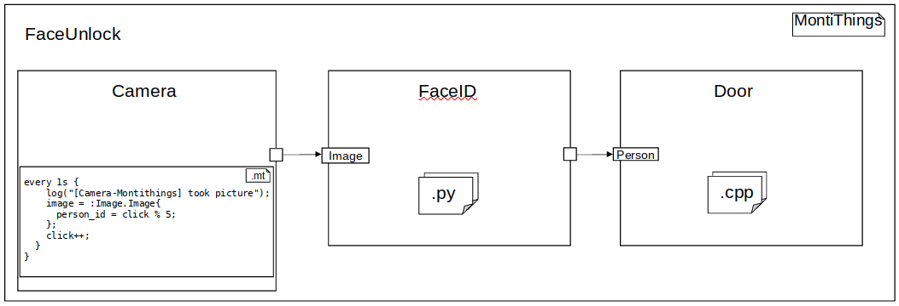

<!-- (c) https://github.com/MontiCore/monticore -->
# FaceUnlock - FaceID Door Opener with Google's "Protocol Buffers"

This example shows how to set up a pipeline with components using different 
high-level-programming-languages. 
Additionally, by using the protobuf-generator "cd2proto", we leverage the language-spanning
capabilities of the
[Google-Protobuf-Language](https://developers.google.com/protocol-buffers)
([GitHub](https://github.com/protocolbuffers/protobuf)).

The elegance of retrieving a resembling `FaceUnlock.proto` definition for a descriptive
class diagram (i.e. `src/main/resources/models/unlock/FaceUnlock.cd`)
can be found in generating all necessary type safe bindings for arbitrary (yet *supported*)
languages,
with a fast, memory efficient and stable implementation.
This example shows the communication between montithings-behaviour, a python implementation 
and a C++ implementation.
The montithings-behaviour is defined in `src/main/resources/models/unlock/Camera.mt`,
while the C++- and Python-implementations can be found in `src/main/resources/hwc/unlock`. 



> **Simplified**: The general idea of this example MontiThings-application is to have an 
> IoT-Application that will take a picture of a person with a `Camera`.
> The `Image` will then be send to `FaceID`, which will identify if the visitor is allowed 
> to enter the `Door`. `Door` will therefore only open if the `Person` is authenticated by 
> `FaceID`.

To keep things simple, the example `Camera` will send an integer resembling a specific person, 
instead of an actual image (or byte-array).
Another approach could be to couple the `Image`-port to a Sensor-port 
(see Sensor-Actuator-Manager).
Also, in lack of a real world test-bench, the example `FaceID` makes a "database-lookup"
on a hash-map instead of actually querying a database.
And the example `Door` will only print to its log if a `Person` is allowed.
Regardless of these limitations, the user should be able to integrate this example into a real 
test-bench, when making the according modifications:

> **Advanced**: The `Camera` will capture a byte-array, send it to `FaceID`, 
> possibly a cloud-service, where a lookup on PostgreSQL, Keycloak, etc. will be done,
> and then send the result to the `Door`-Microcontroller-application, 
> where an actuator will open the lock.

We will also show how a language can be integrated into the montithings-Code-Generator
"montithings2cpp" at the example of the duck-typed language [Python](https://python.org).
We then derive guidelines and design patterns that may be followed to integrate a new 
language with the Generator.

## Getting started
### **Step 0**
- You will have to use `protoc`, Google's Protobuf-Compiler.
  We have developed this project with `protoc` version [3.12, 3.21).
- You will also have to install a protobuf-library, that can work with the `protoc`-version.
  Safe is a version equal to `protoc`, e.g. 3.12.x for `protoc`-v3.12
  As we use C++ and Python here, you will need both libraries installed
You can install compatible versions with 
the recommended montithings-install-script `installLinux.sh`
or install the dependencies manually
```bash
sudo apt install protobuf-compiler libprotobuf-dev python3-protobuf
```
You may install the newest release from 
[GitHub:protobuf/releases](https://github.com/protocolbuffers/protobuf/releases)

### **Step 1**
 To get the example up and running, generate the code:
```bash
mvn clean install
```
### **Step 2**
and build the binaries for all compiled components:
```bash
cd target/generated-sources
./build.sh
```
After the C++-code and proto-code are built, and the python files are in place,
make sure you have an MQTT-Broker running.
You can use mosquitto.
```bash
# check if you have mosquitto running and start it, if not running already
systemctl info mosquitto.service
systemctl start mosquitto.service

# or run it locally in another terminal:
systemctl stop mosquitto.service # (if the service is running)
mosquitto                        # starts an MQTT-Broker on localhost

# listen to all MQTT-Topics:
mosquitto_sub -v -t "#"
```
### **Step 3**
After you made sure there is an MQTT-Broker that can be used for communication, start all components:
```bash
cd build/bin
./run.sh
```
You may observe the component-logs with tail. Omit "-f", if you just want a peek into logs.
```bash
tail -f unlock.FaceUnlock.camera.log # Montithings-Behaviour
tail -f python/FaceID.log            # Python-Behaviour
tail -f unlock.FaceUnlock.door.log   # C++-Behaviour
```
To stop the processes simply execute in the same folder
```bash
./kill.sh
```

This code generation is built for/with the following maven configuration parameter
```xml
<splitting>LOCAL</splitting>
<messageBroker>MQTT</messageBroker>
<serialization>Protobuf</serialization>
``` 
## Modify behaviour - hand-written-code and interfaces
Hand written code, or "HWC", is user defined behaviour that interfaces with generated Files.
For this example you will find three HWC-files 
```bash
src/main/resources/hwc
- DoorImpl.cpp
- DoorImpl.h
- FaceIDImpl.py
```
You may find that HWC-Files match the component-name they provide behaviour for,
suffixed with an `Impl` and the language they should be run in.
In the package `unlock`, there are two components `Door` And `FaceID`.
- The `Door`-component will be generated and compiled to use C++-behaviour.
- The `FaceID`-component will be generated to use Python-behaviour.

Depending on the file extension you provide your code in, 
the generation, compilation and execution of the resulting component differs.
Providing HWC will also eliminate the need for a `behaviour {}`-Block 
in the `.mt`-component-definition.

> In the following we will look on Python-HWC, at the example of FaceID

The `FaceIDImpl` file (HWC) interfaces with the `FaceIDImplTOP` file,
which can be found after generating (Step 1) in `target/generated-sources/hwc`.
In the Python integration, the HWC implements the corresponding `ImplTOP`-class, which
  - needs an `__init__`-call that instantiates the FaceIDImplTOP-class with a client_id 
  - provides an MQTT-Connector `MQTTConnector` for in/out-ports 
  - enforces the `IComputable`-Interface, 
    so the user has to implement the 
    - `compute`-method, which is the entrypoint to manipulate in/out-ports,
       whenever a message on an in-port is received
    - *optional* `getInitialValues`-method, which is called when MQTT is connected, 
      to initialize the state of in/out-ports  

After providing HWC, the component is then encapsulated in the actual component `FaceID.py`,
which can also be found in `target/generated-sources/hwc`
In the case of Python this only takes the implementation of `FaceIDImpl` and starts
the `MQTTConnector` from `FaceIDImplTOP` with a `connect()`, respectively `paho.mqtt.client.MQTTClient.loop_forever()`.
On startup, the `MQTTConnector` will
- publish its given client_id [client.id] under topic `components` as a topic-string
  - i.e. `unlock.FaceUnlock.faceid` as topic-string `unlock/FaceUnlock/faceid`
- subscribes to `/connectors/[client/id]/[in-port]`, 
  to later subscribe to the topics on which the port should receive data
  - i.e. subscribe topic `/connectors/unlock/FaceUnlock/faceid/image`
- connect all out-ports to the appropriate topics under topic `/ports/[client/id]/[out-port]`
  - i.e. topic `/ports/unlock/FaceUnlock/faceid/visitor` for the `FaceID`-`visitor`-out-port

The component `FaceUnlock` will thus be notified, that a new component has subscribed
the MQTT-Broker.
It will then publish on the `/connectors/#`-topic, which in-ports should be subscribed
to what topics.

### Using ports in HWC
On setup there will also happen an instantiation of the fields
- `FaceIDImplTOP._input: FaceIDInput`
- `FaceIDImplTOP._result: FaceIDResult`. 
These hold the ports that the HWC has to interact with.
Because the symbols have to be matched against the subscribed in-port-topics,
the lookup has to be done dynamically, to avoid class-loading.
This lead to an implementation, such that the user has to access a port by string-lookup
like so:
```py
self._input.ports['image']
self._result.ports['visitor']
```
The ports themselves, however, are an instantiation of the compiled protobuf-definition.
So one may use the protobuf-provided methods like 
[documented for python](https://developers.google.com/protocol-buffers/docs/pythontutorial):
```py
image = self._input.ports['image']
visitor = self._result.ports['visitor']

visitor.visitor_id = image.person_id
```
Consecutive calls of `FaceID.compute()` were required to access previous state,
which one initializes with `FaceID.getInitialValues()`.
Therefore the implementation was required to retain state, which is done by providing
the stateful instances of `_input` and `_result`.
That way, when receiving on an in-port, the HWC may decide to use/save the state of
`_input.ports`
so that when receiving on another in-port the previously set port may be used.
Also, as the `compute` method is now state-bound to `ImplTOP`, we don't directly see 
from which port the `compute` was initiated.
For that purpose, a field `FaceIDImplTOP.published_on_port` may be used for additional
control flow.

Once the HWC has manipulated all fields and is ready to send, this can be done via
the method `FaceIDImplTOP.send_port_visitor()` for the out-port `visitor`.
As the out-ports are always using the same behaviour, these are generated statically
with the pattern `send_port_[out-port]`, and may be used for every out-port alike
for a side-effect-ful `publish` on every desired out-port.

### Serialization and Deserialization of in-/out-port-data
One key decision to why to use protobuf is the efficient format of serialized data. 
The deserialization on receiving on an in-port and serialization when sending to an 
out-port is done implicitly. 
The user does not have to interact with the de-/serialization-process.
Because we know which data type will be delivered to which port, when instantiating
`Input` and `Result`, the appropriate Protobuf-constructors are already in place.
Therefore, when receiving data on in-port `image`, this is directly translated to
be deserialized by the `Image()`-object.
Similarly, because the appropriate out-port `visitor` is manipulated directly,
when calling `send_port_visitor()`, the corresponding `Person()`-object, that holds
all `visitor`-information, is serialized implicitly when publishing. 

## Integrate another language to use Google's "Protocol Buffers"


## Design Decisions
#### json-encapsulation
@Sebastian
Although protobuf could be put published solely as the protobuf-String, this interferes
with MontiThings' mechanism to keep track on messages.
The protobuf string is instead encapsulated in a JSON-Format that MontiThings already
knows:
```json
{
    "value0": {
        "payload": {
            "nullopt": <nullopt>,
            "data": <base64-encoded-serialized-protocol-buffer>
        },
        "uuid": <message-uuid>
    }
}
```
> The base64-encoding has to happen, because the C++-Implementation for JSON crashes for null-Bytes in protobuf

--------
# DELETE / REWRITE / ...
Since `splitting` is set to `LOCAL` (default is `OFF`) the generator will create 
multiple independent applications from the code. 
These applications are intended to be executed on a single machine.  
Secondly, `messageBroker` set to `MQTT` specifies that the generated 
applications will use a [MQTT message broker][mqtt] to enable the applications 
to communicate. 
In our case, we use [Eclipse Mosquitto][mosquitto] for that purpose. 
Therefore, before starting the applications you must install and start 
Mosquitto on your local machine (use `mosquitto &` for starting Mosquitto). 

The applications will use MQTT for both management traffic and data traffic.
Composed components tell their subcomponents to which other ports their ports
are connected.
This is done using the MQTT topics that start with `/connectors/`. 

Let's try that out by playing [man-in-the-middle][mitm]: 
Open a terminal window and start listening to all topics starting with 
`/connectors/`: 
```
mosquitto_sub -v -t '/connectors/#'
```
In a second terminal window, build the application and start only the 
`hierarchy.Example` component:
```
./build.sh hierarchy.Example/
cd build/bin
./hierarchy.Example hierarchy.Example 30006 30007
```

The numbers 30006 30007 are normally provided by the `run.sh` script and tell 
MontiThings which network ports to use in case there's no MQTT. 
In the first terminal window you should now see something like this:
```
/connectors/hierarchy/Example/sink/value hierarchy/Example/source/value
```
That's the connector you can see in the picture above. 
The port with the name fully qualified name `hierarchy/Example/sink/value` is 
told to get its data from the port with the fully qualified name 
`hierarchy/Example/source/value`. 


Next, lets try to look at how the data flows through MQTT. 
The data is exchanged using the topics that start with `/ports/`
In your first terminal window, listen to those topics:
```
mosquitto_sub -v -t '/ports/#'
```
Next, start all of the applications as usual using your second terminal window:
```
./run.sh
```

Now, you should see the messages exchanged by the components running through 
the first terminal window:
```
/ports/hierarchy/Example/source/value {
    "value0": 1
}
/ports/hierarchy/Example/source/value {
    "value0": 2
}
/ports/hierarchy/Example/source/value {
    "value0": 3
}
```
As you can see the `hierarchy/Example/source/value` port sends increasing 
numbers. Great!

Now stop the application in the second terminal window:
```
./kill.sh
```
In the first terminal window you should now see that there are no new messages 
coming in.

If you provide the hostname and port number of the MQTT broker to the 
application when starting it, it is also possible to use MQTT brokers located on
different machines, and thus, to let distributed components communicate.


[mqtt]: https://en.wikipedia.org/wiki/MQTT
[mitm]: https://en.wikipedia.org/wiki/Man-in-the-middle_attack
[mosquitto]: https://mosquitto.org/

# Design decisions