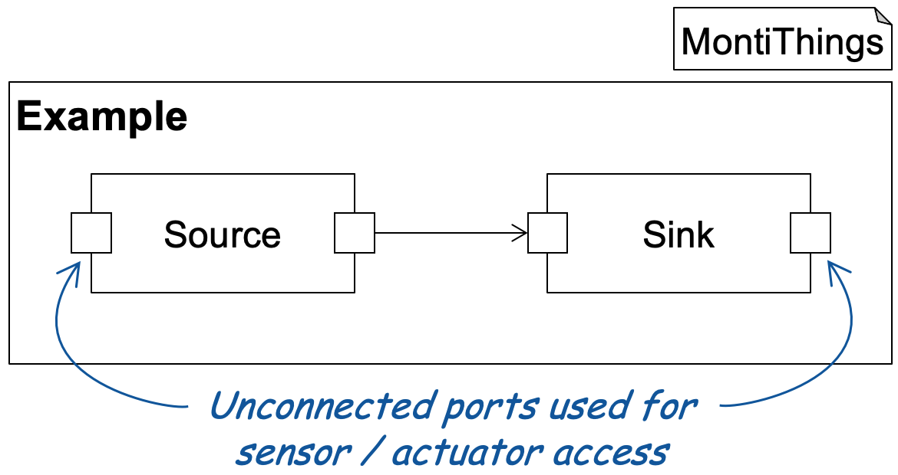

<!-- (c) https://github.com/MontiCore/monticore -->
# Sensor & Actuator Access

This example shows how to connect components to sensors and actuators or, more
generally speaking, hardware.
The example is based on the basic-input-output example but has two additional
ports:



The additional unconnected ports can be used for accessing hardware such as 
sensors and actuators.
To do so, developers can provide Freemarker templates in the hand-written code 
folder. 
MontiThings uses the templates to inject code in the ports.
To enable MontiThings to find the templates, you have to give them specific 
names and replace `<ComponentName>` and `<PortName>` with the names of the 
component and port you want to inject your code into: 
- To add import statements, use `<ComponentName><PortName>PortInclude.ftl`
- To provide values to the component (i.e. implement an incoming port), 
use `<ComponentName><PortName>PortProvide.ftl`
- To process values from the component (i.e. implement an outgoing port), 
use `<ComponentName><PortName>PortConsume.ftl`

For example, here the `SourceSensorPortProvide.ftl` template 
implements the incoming port (called `sensor`) of the `Source` component. 
Templates for incoming ports need to call the `setNextValue()` method to provide
values to the architecture. 
Here, we just count up numbers with stepsize 2:
```
static int counter = 0;
counter += 2;
this->setNextValue (counter);
```

Similarly, we can implement using the outgoing port of the `Sink` component 
which is called `Actuator`. 
For the purpose of not requiring any hardware to run this example, we just print
the values to the console.
This is done by `SinkActuatorPortConsume.ftl`:
```
if (nextVal)
  {
    std::cout << "Sink: " << nextVal.value () << std::endl;
  }
else
  { 
    std::cout << "Sink: " << "No data." << std::endl; 
  }
```
If there's a value at the port it prints "Sink: " followed by the value at the 
port. 
Otherwise (if the compute method does not write data to that port), we only 
print "Sink: No data.".
As this uses `std::cout` our C++ code also requires an include statement which
we add with the `SinkActuatorPortInclude.ftl` template:
```
#include <iostream>
```

The components have no real functionality for easier comprehensibility of 
this example but just forward the data provided on their incoming port to their
outgoing port. 
Accordingly, running this example will result in the `Sink` component printing 
numbers in steps of 2: 
```
Sink: 2
Sink: 4
Sink: 6
Sink: 8
Sink: 10
Sink: 12
Sink: 14
```