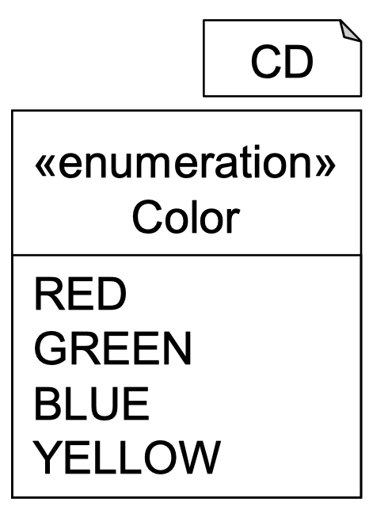
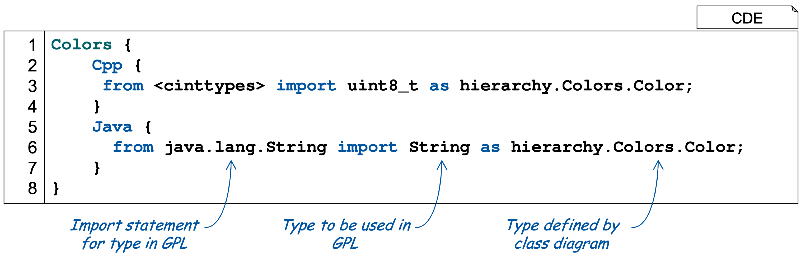
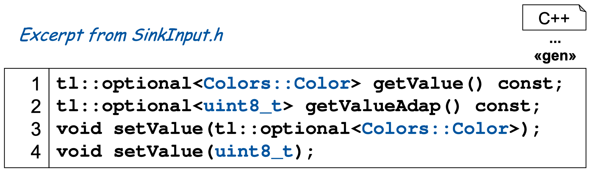

<!-- (c) https://github.com/MontiCore/monticore -->
# Class Diagrams

This example demonstrates how to define types used within MontiThings using 
class diagrams. Here the two components `Source` and `Sink` exchange values of
type `Color` which is defined in an `enum` of a class diagram. 

While the types defined by class diagrams are great for keeping the model 
independent of the target language, they are sometimes less convenient to use
in impl files. For this use case, MontiThings allows to specify adapters to 
convert between class diagram types and implementation specific classes.

The sytax is similar to the sytax of import statements in Python. In this 
example, the C++ generator will offer alternative methods that convert the 
`Color` type defined in the class diagram to `unit_8`, which is defined by the
`<cinttypes>` header in C++.

In the generated code, the user will now have the option to choose between 
`getValue()` for retrieving the original class diagram type or `getValueAdap()`
for retrieving the value of the adapted type. Similarly, MontiThings accepts 
both the class diagram type and the adapted type for setting the value. 

	

As MontiThings does not know the adapted types, the conversion cannot be done 
automatically. The user needs to implement, in this case, an `ColorsAdapter` 
class that provides methods for converting between the types using the 
`convert()` method. MontiThings will call this method whenever it is necessary
to convert between the two types.
