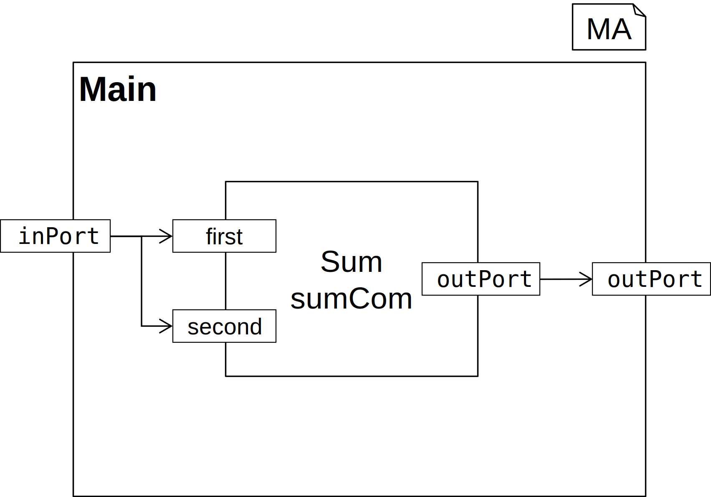
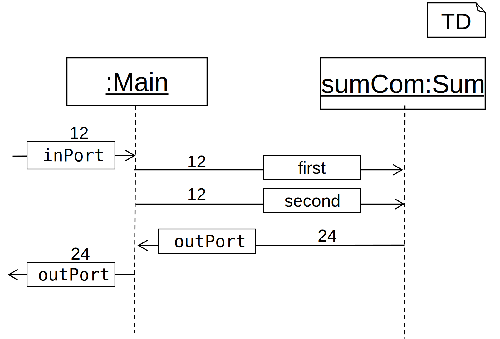

# SD4ComponentTesting

This project implements a language with a generator for writing tests of Internet of Things applications generated using MontiThings.
The language for a SD4C model is derived from the [sd-language](https://git.rwth-aachen.de/monticore/statechart/sd-language) with added support of [OCL](https://git.rwth-aachen.de/monticore/languages/OCL) expressions.

SLE 2021 Project

# An Example Model

Suppose the project for which tests are to be generated has the following structure, as shown in this diagram.



The connections from the diagram would be written down components as shown in the following two code sections.

```
component Main {
  port in int inPort;
  port out int outPort;

  Sum sumCom;

  inPort -> sumCom.first; 
  inPort -> sumCom.second;
  sumCom.outPort -> outPort;
}
```

```
component Sum {
  port in int first;
  port in int second;

  port out int outPort;
}
```

Having the application specified, we come up with an idea of a test case for the application. These test cases normaly describing how the components of an application handle a predefined situation with inputs, while keeping checked that the results are within expectations.

An exemplary test case would be to check if the application returns 24 for an input of 12. Representing this test case in a graphical syntax would result in something like the following test diagram, which is a variation of the sequence diagram from sd-language.



Transforming this into textual syntax for generating tests would result in such a SD4C test diagram that we would save as `MainTest.sd4c`.

```
testdiagram MainTest for Main {
  -> inPort : 12;
  inPort -> sumCom.first, sumCom.second : 12;
  sumCom.outPort -> outPort : 24;
  outPort -> : 24;
}
```

This test diagram will then be used to generate the C++ files for testing the IoT application.

If the test diagram for some reason does not meet the application architecture (e. g. message exchange between components that are not connected in the architecture) the Context Condition checks will fail and throw an error before generating the test files. Check out [this documentation](src/main/grammars/de/monticore/lang/README.md) for more information about CoCos.

For more information about the sd4c language please check out the [grammar](src/main/grammars/de/monticore/lang/README.md) documentation.

# Command Line Interface (CLI)

This section describes the CLI tool of the SD4ComponentTesting Generator.
The CLI tool provides typical functionality used when
processing models. To this effect, it provides funcionality
for

- parsing,
- coco-checking,
- pretty-printing,
- generating.

The requirements for building and using the SD4C CLI tool are that JDK 8 (or JDK 11 or JDK 14), Git, and Maven are installed and available for use in Bash.
This document describes how to build the CLI tool from the source files.
Afterwards, this document contains a tutorial for using the CLI tool.

## Building the CLI Tool from the Sources

It is possible to build an executable JAR of the CLI tool from the source files located in GitLab.
The following describes the process for building the CLI tool from the source files using Bash.
For building an executable Jar of the CLI with Bash from the source files available in GitLab, execute the following commands.cccc

First, clone the repository:

```
git clone https://git.rwth-aachen.de/monticore/montithings/sd4componenttesting.git
```

Change the directory to the root directory of the cloned sources:

```
cd sd4componenttesting
```

Then build the project by running (Info: you need to have Maven installed for this):

```
maven clean install
```

Congratulations! You can now find the executable JAR file `sd4componenttesting-7.0.0-SNAPSHOT-cli.jar` in the directory `target/` (accessible via `cd target/`).

## Tutorial: Getting Started Using the SD4ComponentTesting CLI Tool

The previous sections describe how to obtain an executable JAR file (SD4ComponentTesting CLI tool). This section provides a tutorial for using the SD4ComponentTesting CLI tool. You should create a new folder for this tutorial, you may create this new folder anywhere you want, and copy the CLI tool into the newly created folder. The following examples assume that you locally named the SD4ComponentTesting tool `sd4componenttesting-cli.jar`.
If you build the CLI tool from the sources, you may consider renaming the built JAR.
Please do not use the CLI tool from inside the target/ folder for this Tutorial. The target folder contains models which can lead to some (for the purpose of this tutorial unwanted) sideeffects.

### First Steps

Executing the Jar file without any options prints usage information of the CLI tool to the console:

```
$ java -jar sd4componenttesting-cli.jar 
usage: SD4ComponentTestingCLI
 -c,--coco                  Checks all CoCos for the input.
 -g,--generate <file>       Generate c++ tests for each SD4CT and save them in
                            specified files (optional) or based on the sd4c file
                            name.
 -h,--help                  Prints this help informations.
 -i,--input <arg>           Processes the list of SD4CT input artifacts.
                            Argument list is space separated. CoCos are not
                            checked automatically (see -c).
 -path <arg>                Sets the artifact path for imported symbols, space
                            separated.
 -pp,--prettyprint <file>   Prints the input SD4CTs to stdout or to the
                            specified file (optional).
```

To work properly, the CLI tool needs the mandatory argument `-i,--input <file>`, which takes the file paths of at least one input file containing SD4C models.
If no other arguments are specified, the CLI tool solely parses the model(s). For trying this out, copy the `sd4componenttesting-cli.jar` into a directory of your choice.
Afterwards, create a text file containing the following simple SD4C:

```
testdiagram ExampleTest for Example {
}
```

Save the text file as `Example.sd4c` in the directory where `sd4componenttesting-cli.jar` is located.
Now execute the following command:

```
java -jar sd4componenttesting-cli.jar -i Example.sd4c
```

You may notice that the CLI tool prints no output to the console.
This means that the tool has parsed the file `Example.sd4c` successfully.

### Step 2: Pretty-Printing

The CLI tool provides a pretty-printer for the SD4C language.
A pretty-printer can be used, e.g., to fix the formatting of files containing SD4Cs.
To execute the pretty-printer, the `-pp,--prettyprint` option can be used.
Using the option without any arguments pretty-prints the models contained in the input files to the console.

Execute the following command for trying this out:

```
java -jar sd4componenttesting-cli.jar -i Example.sd4c -pp
```

The command prints the pretty-printed model contained in the input file to the console:

```
testdiagram ExampleTest for Example {
}
```

It is possible to pretty-print the models contained in the input files to output files.
For this task, it is possible to provide the names of output files as arguments to the `-pp,--prettyprint` option.
If arguments for output files are provided, then the number of output files must be equal to the number of input files.
The i-th input file is pretty-printed into the i-th output file.

Execute the following command for trying this out:

```
java -jar sd4componenttesting-cli.jar -i Example.sd4c -pp PPExample.sd4c
```

The command prints the pretty-printed model contained in the input file into the file `PPExample.sd4c`.

### Step 3: Checking Context Conditions
For checking context conditions, the `-c,--coco` option can be used. 
Using this option checks whether the model satisfies all context conditions. 

Execute the following command for trying out a simple example:
```
java -jar sd4componenttesting-cli.jar -i Example.sd4c -c
```
You may notice that the CLI prints an Error to the console when executing this command.

```
[ERROR] 0xSD4CPT1010: Main Component Instance 'Example' has no model file!
```

This means that the model does not satisfies all context condtions. It is missing the model file for the Main component.

Create a text file containing the following simple component called Example:

```
component Example {
}
```

Save the text file as `Example.arc` in the directory where `sd4componenttesting-cli.jar` is located.
When you now execute the command to check the context conditions again you may notice that the CLI prints only `CoCos: All Checked!` to the console while previously executing the command was showing the error.
This means that the CLI now finds the model file for the Main component and satisfies all other context condtions.

Let us now consider a more complex example.
Recall the testdiagram `MainTest` from the `An Example Model` section above.
For continuing, copy the textual representation of the SD4C `MainTest` and save it in a file `MainTest.sd4c` in the directory where the file `sd4componenttesting-cli.jar` is located.
Additionally we need the model files for the Main and Sum component. You can find them in the `An Example Model` section above aswell. Save them as `Main.arc` and `Sum.arc` in the same directory.

Now you can check the context conditions, using the `-c,--coco` option:
```
java -jar sd4componenttesting-cli.jar -i MainTest.sd4c -c
```
After executing this command, you should not experience any errors. If you do encounter errors, there could be dublicate models in any subdirectory defining the same component symbol. In that case go ahead anyway and continue with the next step, which will resolve this error.

### Step 4: Using the Model Path to Resolve Symbols

[...]

//

```
java -jar target/sd4componenttesting-7.0.0-SNAPSHOT-cli.jar -i src/test/resources/examples/correct/MainTest.sd4c -path src/test/resources/examples/correct/ -pp target/MainTest.sd4c -c -g target/MainTest.cpp
```