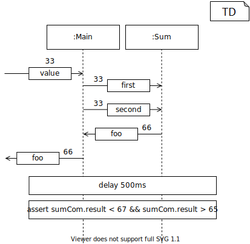

<!-- (c) https://github.com/MontiCore/monticore -->
# Overview

The _SD4ComponentTestingGenerator_ generates a C++ test file out of one SD4ComponentTesting model. Actually the CoCos of SD4ComponentTesting work only on MontiArc models but in the future it is planned that one also can use MontiThings models with behavior. MontiThings offers a PrettyPrinter which transforms valid MontiThings models to MontiArc models. The PrettyPrinter can be found [here](https://git.rwth-aachen.de/monticore/montithings/core/-/blob/develop/languages/montithings/src/main/java/montithings/_visitor/MontiThingsToMontiArcFullPrettyPrinter.java). The C++ test works with the generated C++ classes from MontiThings models, but all MontiArc models can be transfered to MontiThings models. The main restriction is that MontiArc has no behavior.


# Usage

There are two possibilities to use the generator. The first way to generate the C++ test file is to use the `generate` method of the _SD4ComponentTestingGenerator_ class:

`SD4ComponentTestingGenerator.generate(ast, path);`

This method generates the C++ test file for the given _ASTSD4Artifact ast_ of one SD4ComponentTesting model and save the file in the given `path`. To create the AST for the method, one can use the method _loadModel_ from the class _SD4ComponentTestingTool_. The method creates the needed symboltable, creates the AST and also checks all CoCos that the given AST is valid. For further information, see [Tutorial: Getting Started Using the SD4ComponentTesting Tool](https://git.rwth-aachen.de/monticore/montithings/sd4componenttesting/-/tree/develop/#tutorial-getting-started-using-the-sd4componenttesting-tool).

The `generate` method can only generate a test file for one single SD4ComponentTesting model. If one want to generate several test files, one have to call the `generate` method several times.

The second Method is to use the SD4ComponentTestingCLI via the CLI. Then the CLI calls the `generate` method of the _SD4ComponentTestingGenerator_ class with the given values and creates the AST for the given models. For further information, see [Tutorial: Getting Started Using the SD4ComponentTesting CLI Tool](https://git.rwth-aachen.de/monticore/montithings/sd4componenttesting/-/tree/develop#tutorial-getting-started-using-the-sd4componenttesting-cli-tool).

# How the test works

For a better understanding of the functionality of the generated C++ test, we discuss the example [SmallExample.sd4c](../../../../../../../test/resources/examples/correct/SmallExample.sd4c) Testdiagram. It has the _mainComponent_ [Main](../../../../../../../test/resources/examples/correct/Main.arc), which includes two subcomponents of the same MontiArc component type [Sum](../../../../../../../test/resources/examples/correct/Sum.arc). The Sum component type gets two values and should calculate the sum of them. Since MontiArc has no behavior, we consider the component as a blackbox with the desired behavior.

The following Testdiagram shows the example in a kind of UML sequence diagram:



The example wants to test that the port _foo_ gets the message _66_ after getting the message _33_ on port _value_. During the calculation, the component _Main_ should pass the message _33_ to the port _first_ and _second_ of the subcomponent _sumCom_, and the subcomponent should return the message _66_ to the port _foo_ of _Main_. After the execution, the test should wait for 500ms and then the value of the port _result_ of _sumCom_ should be smaller than _67_ and greater than _65_.

Since the computation of the behavior of MontiThings components don't log the messages which passes from one port to another, and the computation of the Main component can not pause to check the current port values, one need an observer to log the messages. The components of MontiThings offers the possibility to attach an observer to the ports. Every time the value of the port changed, the method `onEvent` of every attached observer will call. The generated test contains an observer called PortSpy for every port of every component and subcomponent. They are attached to the ports, and log all messages which passes the ports in a list (see [The Observers](#the-observers) and [The initialization of the test method](#the-initialization-of-the-test-method) for further information). This enables the possibility to check whether some messages are passed to a port. The following sequence diagram shows the procedure of the test simplified to increase the readability.


The first connection in the [SmallExample](../../../../../../../test/resources/examples/correct/SmallExample.sd4c) model `-> value : 33;` leads to the C++ code 

`cmpMain->getInterface()->getPortValue()->setNextValue(Message<int>(33));`

which is the first function call in the diagram (see [MAIN_INPUT](#main_input) for further information). This leads to the function call `onEvent` on the _PortSpy_ _psMValue_ for the _value_ port of the _Main_ component. Since the _value_ port of _Main_ is connected to the ports _first_ and _second_ of the _sumCom_ subcomponent, they are also attached as observer for the _value_ port. This leads to the function call `onEvent` on the port _first_, which includes the call `setNextValue` and therefore also the `onEvent` call of the attached _PortSpy_ _psSFirst_ for the _first_ port of the _sumCom_ component. The `onEvent` call of the port _second_ has the same procedure, but with an own _PortSpy_ _psSSecond_ for the port _second_. Also, the _Main_ _cmpMain_ is attached as an observer to the `setNextValue` and will call if the value of the port _value_ changed. The next sequence diagram shows the procedure of that function call.


The `onEvent` method of _cmpMain_ yields to the function call `compute` which calls all `compute`, methods of the subcomponents of _Main_. The `compute` method of _sumComCmp_ performs the behavior of the component, in this case it will calculate the sum of the ports _first_ and _second_ and sets the value of the port _result_ with the method call `interface->getPortResult()->setNextValue()` in the port _result_. This yields to the call of the `onEvent` methods of the attached observer _psSResult_ (the _PortSpy_ for the _result_ port of the subcomponent _sumCom_) and since the _result_ port is connected to the _foo_ port of the _Main_ component also the port _foo_. In this call the method `setNextValue` of the port _foo_ is called and therefore the `onEvent` of the _PortSpy_ _psMFoo_ for the port _foo_ of _Main_.

After the call `setNextValue` on the port _value_, the _PortSpy_ objects contain a list of all messages which passes the ports. This list is used for checks whether ports get a given message. The section [The asserts](#5-the-asserts) gives a detailed explanation of how the values of the _PortSpy_ objects will check.


# Procedure of the generator

In this chapter we discuss the [SmallExample.sd4c](../../../../../../../test/resources/examples/correct/SmallExample.sd4c) example testdiagram which is introduced in [How the test works](#how-the-test-works) and how the generator generate the C++ test out of it.

The generated test has mainly five parts:

1. [The initialization](#the-initialization)
2. [The struct](#the-struct)
3. [The observers](#the-observers)
4. [The initialization of the test method](#the-initialization-of-the-test-method)
5. [The asserts](#the-asserts)

## The initialization

In the first part, the generator prints the includes of the needed header files. Beside some external libraries, the generator prints the includes of the header file of the given _mainComponent_ MontiArc component type and all header files of the subcomponent types of it. After the includes, the generator print some initialization of the external libraries. The complete template can be found [here]().

For the example, the generator prints the following:

```cpp
// initialization
#include "easyloggingpp/easylogging++.h"
#include <gtest/gtest.h>
#include <chrono>
#include <thread>

#include "Main.h"

#include "Sum.h"

INITIALIZE_EASYLOGGINGPP
```

## The struct

The second step is the printing of the struct for the test. The template for the struct can be found [here](https://git.rwth-aachen.de/monticore/montithings/sd4componenttesting/-/blob/develop/src/main/resources/templates/Struct.ftl).

The struct has a variable for the _mainComponent_ and three variables for all subcomponents of the _mainComponent_. These variables are for the component, the implementation (impl) and the state of the subcomponent. They are needed to get access to the ports of the components and in the future also to get access to more functionalities of MontiThings components.

In the first part of the struct, the generator prints the memory reservation of all needed variables. The second part of the struct is the constructor. The generator prints the creating of the object for the component type of the _mainComponent_ and the assignments of the variables of the subcomponents. The last part of the struct is the destructor, which destruct the _mainComponent_ object and therefore all objects of the subcomponents.

The generator prints the following for the example:
```cpp
// struct for test
struct MainTest : testing::Test
{
  montithings::examples::correct::Main *cmpMain;

  montithings::examples::correct::Sum *sumComCmp;
  montithings::examples::correct::SumImpl *sumComImpl;
  montithings::examples::correct::SumState *sumComState;

  montithings::examples::correct::Sum *sumCompCmp;
  montithings::examples::correct::SumImpl *sumCompImpl;
  montithings::examples::correct::SumState *sumCompState;


  MainTest ()
  {
    cmpMain = new montithings::examples::correct::Main ("examples.correct.Main");

    sumComCmp = cmpMain->getSubcomp__SumCom();
    sumComImpl = sumComCmp->getImpl();
    sumComState = sumComCmp->getState();

    sumCompCmp = cmpMain->getSubcomp__SumComp();
    sumCompImpl = sumCompCmp->getImpl();
    sumCompState = sumCompCmp->getState();
  }

  ~MainTest ()
  {
    delete cmpMain;
  }
};
```

## The observers

The observers are needed to check if the expected messages going through the ports during the procedure of the main MontiThing component (_mainComponent_). The template for the printing of all observers can be found [here](https://git.rwth-aachen.de/monticore/montithings/sd4componenttesting/-/blob/develop/src/main/resources/templates/Observer.ftl). A detail explanation of how the procedure of the MontiThing component works can be found in [How the test works](#how-the-test-works).

The generator first prints a template for the observer, which is called _PortSpy_. Then for every port of the _mainComponent_ the generator prints a single _PortSpy_ class which records all messages going through the port. In the next step, the generator prints for every port of every subcomponent of the _mainComponent_ a own _PortSpy_ class. It is necessary that they are all unique, so the name of the classes are for ports of the _mainComponent_ ```PortSpy_compTypeName_portName``` and for the subcomponents ```PortSpy_compTypeName_compName_portName```. This guarantees that every port has its own observer. If two ports have the same _PortSpy_ it is not possible to check the passed messages of the ports correctly.

The generator prints the following _PortSpy_ for the _value_ port of the _mainComponent_:

```cpp
/**
 * This class records values of the "Main" component's "value" port
 */
class PortSpy_Main_Value : public PortSpy<montithings::examples::correct::Main, int>
{
  public:
    using PortSpy::PortSpy;

    void onEvent () override
    {
      tl::optional<Message<int>> value
          = component->getInterface()->getPortValue()->getCurrentValue(this->getUuid ());
      recordedMessages.push_back (value);
    }
};
```

The _PortSpy_ for the _first_ port of the subcomponent _sumCom_:

```cpp
/**
 * This class records values of the "sumCom" component's "first" port
 */
class PortSpy_Sum_SumCom_First : public PortSpy<montithings::examples::correct::Sum, int>
{
  public:
    using PortSpy::PortSpy;

    void onEvent () override
    {
      tl::optional<Message<int>> value
          = component->getInterface()->getPortFirst()->getCurrentValue(this->getUuid ());
      recordedMessages.push_back (value);
    }
};
```

### The PortSpy

The _PortSpy_ contains a list `std::vector` which will supplement by a new element with the current port value every time the `onEvent` method of a _PortSpy_ is called. This yields to a history of all passed messages to the port and allows to check the messages if they are the expected ones in the expected order.

## The initialization of the test method

At the beginning of the test method, the generator will print the creation of the _PortSpy_ classes, and the function call to attach the _PortSpy_ to the corresponding port. For the _value_ port of the _mainComponent_ the generator prints the following:

```cpp
  // PortSpy of the "Main" component
  LOG(INFO) << "PortSpy to port Value of main component cmpMain attached";
  PortSpy_Main_Value portSpyMainValue(cmpMain);
  cmpMain->getInterface()->getPortValue()->attach(&portSpyMainValue);
```

After that the generator will print some initialize calls of the _mainComponent_:

```cpp
  // When
  cmpMain->setUp(EVENTBASED);
  cmpMain->init();
  cmpMain->start();
```

They are needed that the _Main_ component works as expected. The complete template can be found [here](https://git.rwth-aachen.de/monticore/montithings/sd4componenttesting/-/blob/develop/src/main/resources/templates/TestMethodInitialization.ftl).

## The asserts

Since SD4ComponentTesting has five different connection types, the generator prints five different types of assertions/tests. The assertions in general are needed to test the expected behavior, which is defined in the SD4ComponentTesting model. The complete template can be found [here](https://git.rwth-aachen.de/monticore/montithings/sd4componenttesting/-/blob/develop/src/main/resources/templates/Asserts.ftl).

### MAIN_INPUT

The connection type _MAIN\_INPUT_ yields to a call of `setNextValue` to set the given value as the value of the given input port of the _mainComponent_. The generator prints for the example `-> value : 33;` (see line four of [SmallExample.sd4c](../../../../../../../test/resources/examples/correct/SmallExample.sd4c)) the following code:

```cpp
  // set input of mainComp
  LOG(INFO) << "start computing with next value 33";
  cmpMain->getInterface()->getPortValue()->setNextValue(Message<int>(33));
```

As explained in [How the test works](#how-the-test-works) calls this function the `compute` method of the components. This causes the list in the _PortSpy_ objects to be filled, so after the execution of this method, one can check the passed messages of the ports. If one adds another _MAIN\_INPUT_ in one SD4ComponentTesting model, the `compute` method will execute again, and the lists of the _PortSpy_ objects will supplement by further elements.

### MAIN_OUTPUT

The connection type _MAIN\_OUTPUT_ yields to an assertion which checks the last element of the list of the corresponding _PortSpy_, and a check if the element exists. If one adds more than one _MAIN\_INPUT_, the check will use the last element of the list after the last `compute` execution. The generator prints for the example `foo -> : 66;` (see line eight of [SmallExample.sd4c](../../../../../../../test/resources/examples/correct/SmallExample.sd4c) the following code:

```cpp
  // check output of mainComp
  LOG(INFO) << "check main output";
  ASSERT_TRUE (portSpyMainFoo.getRecordedMessages().back().has_value());
  EXPECT_EQ (portSpyMainFoo.getRecordedMessages().back().value().getPayload(), 66);
```

### DELAY

The connection type _DELAY_ yields to a code that paused the thread for the given time. So the generator prints for the example `delay 500ms` (see line ten of [SmallExample.sd4c](../../../../../../../test/resources/examples/correct/SmallExample.sd4c)) the following code:

```cpp
  // delay
  LOG(INFO) << "${prettyPrinter.prettyprint(sD4CElement)?replace("\n", "")?replace("\r", "")}";
  std::this_thread::sleep_for(std::chrono::${componentHelper.printTime(sD4CElement.getSIUnitLiteral())})
```

### EXPRESSION

The connection type _EXPRESSION_ yields to the corresponding C++ code and a check that this expression is evaluated to _TRUE_. The generator prints for the example `assert sumCom.result < 67 && sumCom.result > 65;` (see line twelve of [SmallExample.sd4c](../../../../../../../test/resources/examples/correct/SmallExample.sd4c)) the following code:

```cpp
  // test Expression
  LOG(INFO) << "check expression   assert sumCom.result < 67 && sumCom.result > 65;";
  ASSERT_TRUE( portSpySumSumComResult.getRecordedMessages().back().value().getPayload().value()  < 67 &&  portSpySumSumComResult.getRecordedMessages().back().value().getPayload().value()  > 65);
```

### DEFAULT

The connection type _DEFAULT_ contains a list of _targets_. For every _target_ the generator prints a check if the list of the corresponding _PortSpy_ contains the expected amount of elements, the expected element of the list has a value, and the check if the expected element has the expected value. The position of the expected element is the number of times it occurs in a _DEFAULT_ connection as a _target_. If one want to check that a port has the value _x_, and the port gets first the value _y_, then one have to check the port two times in a _DEFAULT_ connection.

For the example (see line five, six and seven of [SmallExample.sd4c](../../../../../../../test/resources/examples/correct/SmallExample.sd4c)) the generator prints the following code:

```cpp
  // check input of Target sumCom.first
  LOG(INFO) << "check   value -> sumCom.first : 33;";
  ASSERT_TRUE (portSpySumSumComFirst.getRecordedMessages().size() >= 1);
  ASSERT_TRUE (portSpySumSumComFirst.getRecordedMessages().at(0).has_value());
  EXPECT_EQ (portSpySumSumComFirst.getRecordedMessages().at(0).value().getPayload(), 33);

  // check input of Target sumCom.second
  LOG(INFO) << "check   value -> sumCom.second : 33;";
  ASSERT_TRUE (portSpySumSumComSecond.getRecordedMessages().size() >= 1);
  ASSERT_TRUE (portSpySumSumComSecond.getRecordedMessages().at(0).has_value());
  EXPECT_EQ (portSpySumSumComSecond.getRecordedMessages().at(0).value().getPayload(), 33);

  // check input of Target foo
  LOG(INFO) << "check   sumCom.result -> foo : 66;";
  ASSERT_TRUE (portSpyMainFoo.getRecordedMessages().size() >= 1);
  ASSERT_TRUE (portSpyMainFoo.getRecordedMessages().at(0).has_value());
  EXPECT_EQ (portSpyMainFoo.getRecordedMessages().at(0).value().getPayload(), 66);
```


# License

© https://github.com/MontiCore/monticore

For details on the MontiCore 3-Level License model, visit
https://github.com/MontiCore/monticore/blob/dev/00.org/Licenses/LICENSE-MONTICORE-3-LEVEL.md

# Further Information

* [Project root: MontiCore @github](https://github.com/MontiCore/monticore)
* [MontiCore documentation](http://www.monticore.de/)
* [**List of languages**](https://github.com/MontiCore/monticore/blob/dev/docs/Languages.md)
* [**MontiCore Core Grammar Library**](https://github.com/MontiCore/monticore/blob/dev/monticore-grammar/src/main/grammars/de/monticore/Grammars.md)
* [CD4Analysis Project](https://github.com/MontiCore/cd4analysis)
* [Best Practices](https://github.com/MontiCore/monticore/blob/dev/docs/BestPractices.md)
* [Publications about MBSE and MontiCore](https://www.se-rwth.de/publications/)
* [Licence definition](https://github.com/MontiCore/monticore/blob/master/00.org/Licenses/LICENSE-MONTICORE-3-LEVEL.md)
